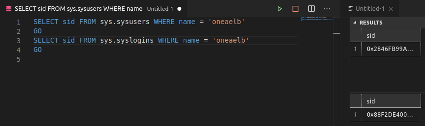
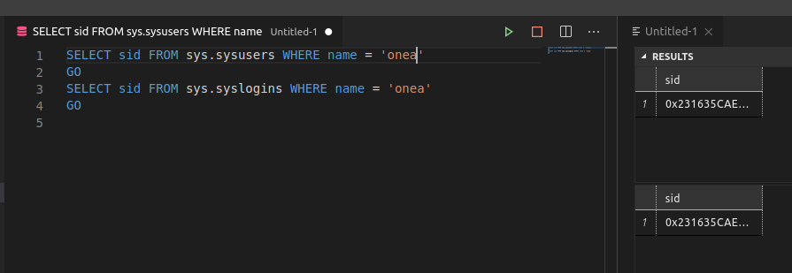
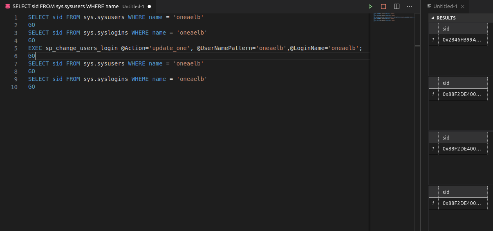

= VIM Sweeties
Doc Writer <mail@vincentbockaert.xyz>
:icons: font
:source-highlighter: highlightjs

== install mssql-cli

[source, bash]
----
pip install --user mssql-cli 
----

== connect to mssql db

First of make sure that can you actually connect.
What I mean by this is checking the configuration, for VPC, did you add your IP to it, is the outbound rule set to 0.0.0.0/0 for the security group.
Are connections from remote allowed, etc.

If yes to all of the above you can try connecting via.
The easiest way to be sure of all this is to connect via the bastionhost/run the commands via the bastionhost.

[source,bash]
----
mssql-cli -U onea -P PASSWORD_HERE -S mssql-009.cfddrlt1awcy.eu-west-1.rds.amazonaws.com
----

== backup a database

You require a "option group" with the SQLSERVER_BACKUP_RESTORE option for the sql server.
For Onea this is backup-to-s3.
You also require a S3 bucket linked to this option-group.

[source,sql]
....
master> sp_databases;                                                                                                                                                                                      
Time: 0.453s
master> EXEC msdb.dbo.rds_backup_database                                                                                                                                                                  
Time: 0.252s
master> EXEC msdb.dbo.rds_backup_database 
....... @source_db_name='UPCONSTRUCT_TEST', 
....... @s3_arn_to_backup_to='arn:aws:s3:::mssql-backups.onea.be/upconstruct-test-20201203.sql', 
....... @overwrite_S3_backup_file=1; 
.......                                                                                                                                                                                                    
Time: 0.503s
master> quit
....

== server principal blah blah 

If you restore a db & then added the sql server logins you might run an sync problem between existing users from the restored db.
And the logins (they can have the same name but if the isn't the same you're toast).

The following image shows the problem.

For whatever reason this problem isn't a issue with the super-admin user we create, probably some black SQL magic that prevents this during restore.
See the image below for how the sid should be:

This can luckily be fixed rather easily via:

[source, sql]
----
SELECT sid FROM sys.sysusers WHERE name = 'oneaelb'
GO
SELECT sid FROM sys.syslogins WHERE name = 'oneaelb'
GO
EXEC sp_change_users_login @Action='update_one', @UserNamePattern='oneaelb',@LoginName='oneaelb';
GO
SELECT sid FROM sys.sysusers WHERE name = 'oneaelb'
GO
SELECT sid FROM sys.syslogins WHERE name = 'oneaelb'
GO
----

.Similarly to sync the other user/login
[source, sql]
----
SELECT sid FROM sys.sysusers WHERE name = 'scanproviewer'
GO
SELECT sid FROM sys.syslogins WHERE name = 'scanproviewer'
GO
EXEC sp_change_users_login @Action='update_one', @UserNamePattern='scanproviewer',@LoginName='scanproviewer';
GO
SELECT sid FROM sys.sysusers WHERE name = 'scanproviewer'
GO
SELECT sid FROM sys.syslogins WHERE name = 'scanproviewer'
GO
----
See the image below for the output, you can clearly see that both the user and the login now have the sid that came from the login, the mismatch is gone "hooray".

